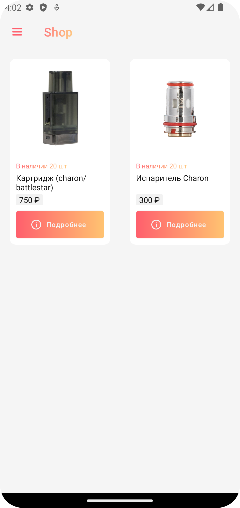
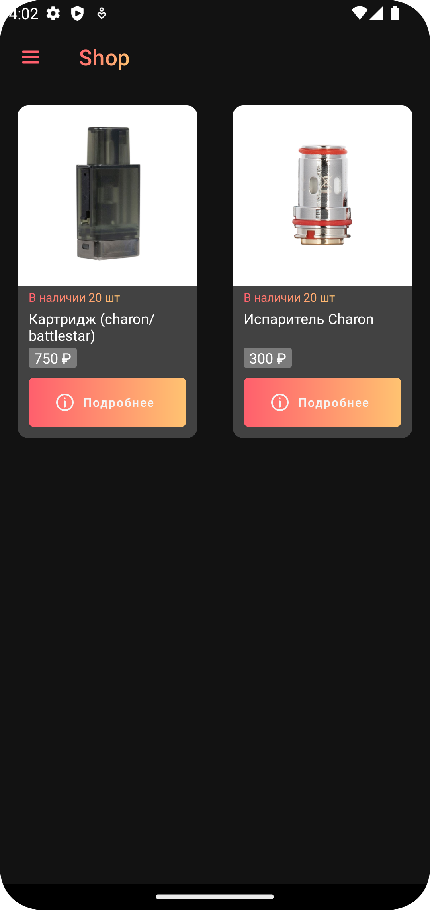
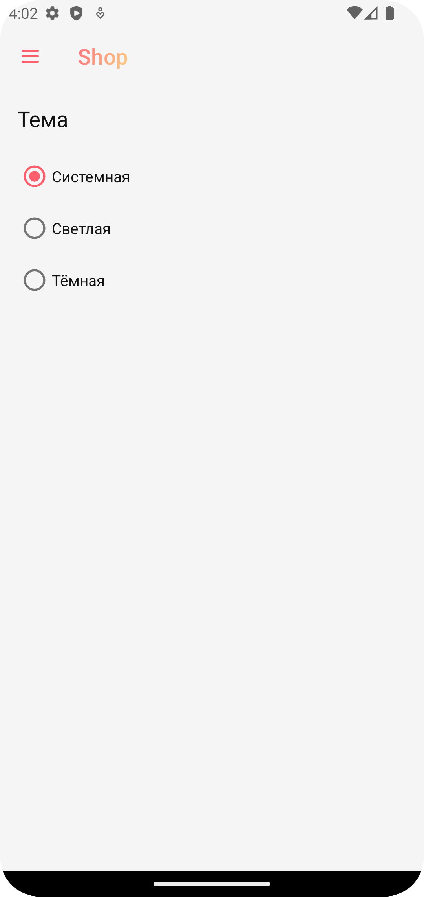
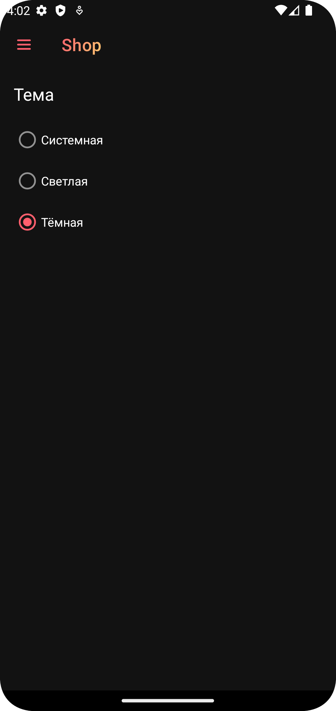
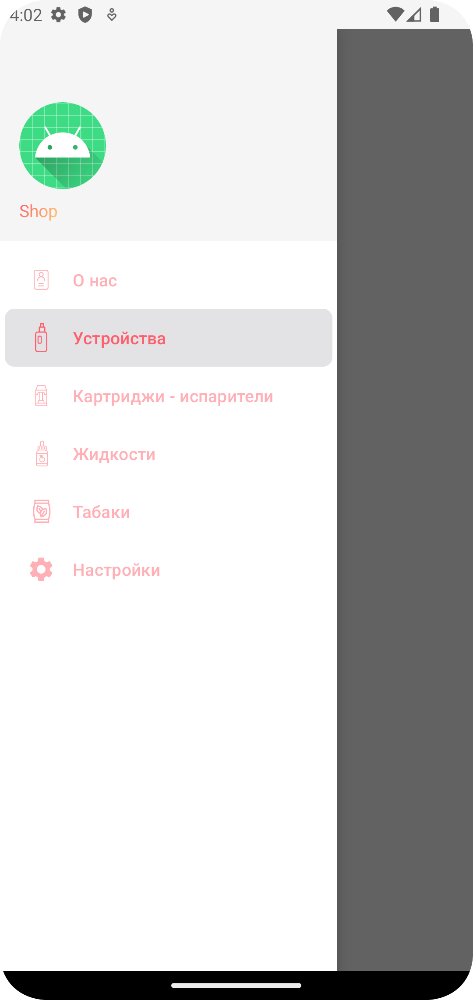
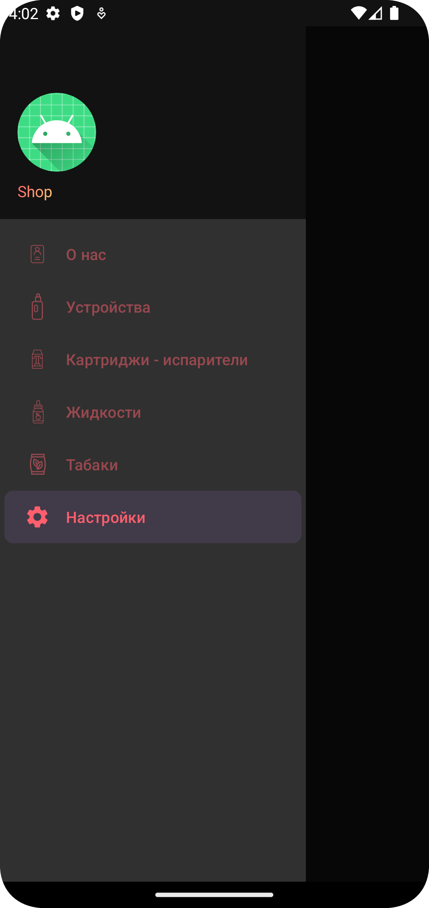

# Приложение-магазин

Следующие технологии были использованы(реализованы) в приложении:
- MVVM
- Реализованы светлая и темная темы
- Dagger2 DI
- Coroutines
- NavComponent
- Firestore Database

## Демонстрация проделанной работы:

|                              Светлая тема                              |                             Темная тема                             |
|:----------------------------------------------------------------------:|:-------------------------------------------------------------------:|
|                      |                      |
|  |  |
|                         |                         |